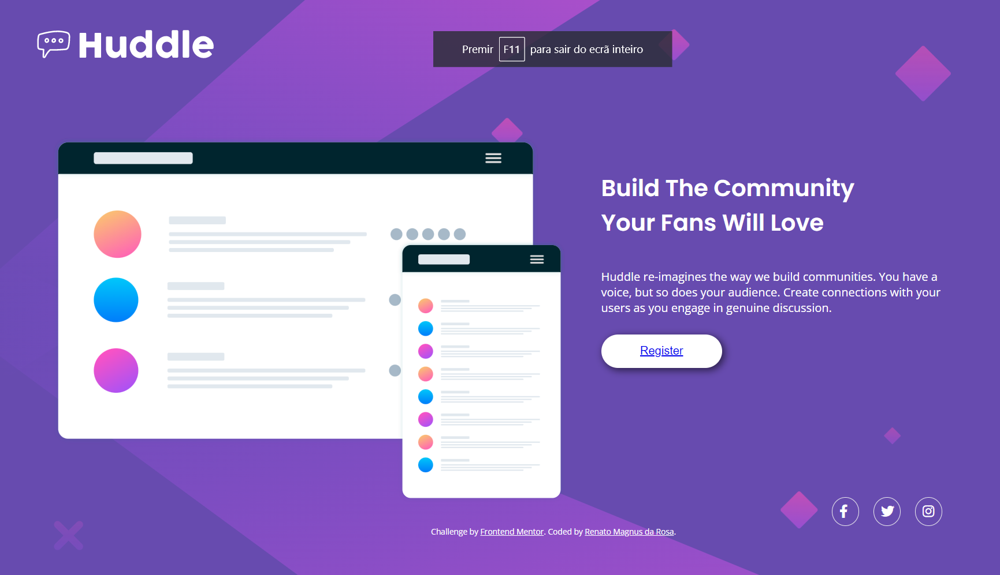

# Frontend Mentor - Huddle landing page with single introductory section solution

This is a solution to the [Huddle landing page with single introductory section challenge on Frontend Mentor](https://www.frontendmentor.io/challenges/huddle-landing-page-with-a-single-introductory-section-B_2Wvxgi0).

## Table of contents

  - [The challenge](#the-challenge)
  - [Screenshot](#screenshot)
  - [Built with](#built-with)
  - [What I learned](#what-i-learned)
  - [Continued development](#continued-development)
- [Author](#author)

### The challenge

Users should be able to:

- View the optimal layout for the page depending on their device's screen size
- See hover states for all interactive elements on the page

### Screenshot




### Built with

- Semantic HTML5 markup
- CSS custom properties
- Flexbox

### What I learned

I learned how somethime we can spend a lot of time to solve something that we think is hard, but when we look other way, we reallize that the answer is very simple, how happened with me when try to put a background color here in diferent ways before try the simple. 

```body {
  background:url("../images/bg-desktop.svg") no-repeat left top fixed;
  background-color: hsl(257, 40%, 49%);
  ```

### Continued development

Everytime I practice some content that I think I already now, I learn so much. So I need keep practicing more and more. 

## Author

- GitHub - [rmagnusr](https://github.com/rmagnusr)
- Frontend Mentor - [@rmagnusr](https://www.frontendmentor.io/profile/rmagnusr)
- LinkedIn - [Renato Magnus da Rosa](https://www.linkedin.com/in/renato-magnus/)
- WhatsApp - +55 (51) 98459-8858


